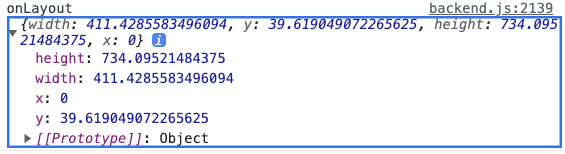

# 4-4, 4-5

# 4-4. useEffect와 useLayoutEffect 훅 이해하기

## 훅 사용법

```tsx
useEffet(콜백_함수, 의존성_목록)
useLayoutEffect(콜백_함수, 의존성_목록)
```

- 컴포넌트 생명주기
    - 컴포넌트를 생성하여 최초 렌더링 과정을 끝마치면 컴포넌트를 마운트 했다고 한다.
    - 컴포넌트가 destroy되어 더는 렌더링 되지 않으면 언마운트 되었다고 한다.

## onLayout 이벤트

### react-native의 onLayout 이벤트 속성

- onLayout 이벤트 속성을 이용하면 화면에 렌더링한 컴포넌트의 위치와 크기를 알 수 있다.
    
    ```tsx
    import type {LayoutChangeEvent} from 'react-native'
    
    ...
    const onLayout = (e: LayoutChangeEvent) => {
      const {layout} = e.nativeEvent
      console.log('onLayout', layout)
    }
    
    ...
    return (
        <View onLayout={onLayout} style={styles.view}>
    ```
    



- (TS) 타입스크립트로 적용할 때는 리액트 네이티브에서 기본 제공하는 Layout관련 타입을 이용하면 된다
    
    ```tsx
    const onLayout = (e: **LayoutChangeEvent**) => {
      const {layout} = e.nativeEvent
    }
    ```
    
    - LayoutChangeEvent 타입
        
        ```tsx
        export interface LayoutChangeEvent {
        	nativeEvent: {
        		layout: LayoutRectangle;
        	}
        }
        ```
        
    - LayoutRectangle 타입 
    : LayoutChangeEvent 내부 layout 은 LayoutRectangle 타입의 객체를 제공하며, 다음과 같다.
        
        ```tsx
        export interface LayoutRectangle {
        	x: number;
        	y: number;
        	width: number;
        	height: number;
        }
        ```
        

### useLayoutEffect와 useEffect 훅의 호출 순서

- **마운트 과정**
    
    컴포넌트 → (컴포넌트 렌더링 시작) 
    → useLayoutEffect 호출 →(화면 나타남) 
    → useEffect 호출 
    → onLayout 이벤트 발생 (컴포넌트 렌더링 끝)
    
    ```tsx
    LOG  android render start
    LOG  android useLayoutEffect called
    LOG  android useEffect called
    LOG  android onLayout called {"height": 734.09521484375, "width": 411.4285583496094, "x": 0, "y": 39.619049072265625}
    ```
    

- **언마운트 과정**
    
    컴포넌트 - (컴포넌트 언마운트 시작) 
    → useEffect 반환 함수 호출 
    → useLayoutEffect 반환 함수 호출 
    → 컴포넌트 파괴
    
    ```tsx
    
    LOG  android useLayoutEffect finished
    
    ```
    

useLayoutEffect와 useEffect 훅의 차이점

- useLayoutEffect: 동기로 실행한다.
   ⇒ 콜백 함수가 끝날 때까지 프레임워크가 기다린다.

- useEffect: 비동기로 실행한다.
   ⇒ 콜백 함수의 종료를 기다리지 않는다.

- 공식 문서에서는 useEffect의 사용을 권장한다.

---

추가적인 사항

## setTimeout, setInterval 사용하기

- (생략)
- +) (TS) 타입스립트의 Partial, Required, Pick 사용방법
    - 
    
    ```tsx
    // 예제 출처: https://ithub.tistory.com/239
    interface IPerson
    {
        name: string;
        age: number;
        gender: string;
    }
    
    /**
     * Partial
     * : 인터페이스의 모든 프로퍼티를 optional하게 변경한다.
     */
    type PartialPerson = Partial<IPerson>;
    const partialPerson: PartialPerson =
    {
        gender: "male" // optional
    }
    
    /**
     * Required
     * 인터페이스의 모든 프로퍼티를 required하게 변경한다.
     */
    type RequiredPerson = Required<PartialPerson>;
    const requiredPerson: RequiredPerson = 
    {
        name: "Jade",  // required
        age: 29,       // required
        gender: "male" // required
    }
    
    /**
     * Pick
     * 대상 타입의 전체 속성 중 필요한 속성만 선택하여 새로운 타입으로 만든다.
     */
    type PickPerson = Pick<IPerson, "name" | "age">;
    const pickPerson: PickPerson =
    {
        name: "Jade", // required
        age: 29,      // required
        // gender: "male" --> (X)
    }
    ```
    

## fetch API 사용하기

- fetch:
    - 자바스크립트 엔진에서 기본 제공하는 API
    - HTTP 프로토콜의 GET, POST, PUT, DELETE와 같은 메서드를 사용하기 쉽게 해 줌
    - blob, json, text와 같은 Response 타입 객체를 Promise 방법으로 얻을 수 있게 해줌
    
- 사용법1: then-체인
    
    ```tsx
    fetch('https://restcountries.eu/rest/v2/all')
        .then((res) => res.json())
        .then((result: any) => {
          //가공해서 countries를 얻어냄
          return countries
        })
        .then((countries => setCountries(countries)))
        .catch(setError)
    ```
    
    - 응용) (TS) any 타입 데이터에서 원하는 데이터만 추출하기
        
        ```tsx
        export type ICountry = {
        	region: string
        	capital: string
        }
        ```
        
        - any 타입의 데이터 result에서 ICountry 타입이 정의한 속성만 골라내기 위해서는 (result가 배열일 때)
        
        ```tsx
           .then((result: any[]) => {
              return result.map((data: any) => { // map 메서드를 호출하여 정의한 속성만 추려냄
                const {region, capital} = data
                return {region, capital} as ICountry // 골라낸 객체를 타입 지정 해 줌
              })
            })
        ```
        
- 사용법2: useEffect 훅 안에서 호출

# 04-5 커스텀 훅 이해하기

- 커스텀훅:
    - 여러 컴포넌트에서 비슷한 패턴으로 사용되는 훅 코드를 추려내어, 재사용할 수 있는 훅 함수를 만들어 좀 더 간결하게 구현하는 방법
    - 더 간결해지므로 로직 공유의 유연하고 가독성이 좋은 것이 장점
- 커스텀 훅의 특징
    - `use~` 로 시작해야 한다.
    - 함수 몸통에서 다른 커스텀 훅 함수를 호출할 수 있다.

## 자주 사용되는 커스텀 훅의 예시

1. (책 예시) useState 상태 Toggle 하기
    
    ```tsx
    import {useState, useCallback} from 'react'
    
    export const useToggle = (
      initialValue: boolean = false,
      deps: any[] = [],
    ): [boolean, () => void] => {
      const [value, setValue] = useState(initialValue)
      const toggleValue = useCallback(() => setValue(value => !value), deps)
    
      return [value, toggleValue]
    }
    ```
    

1. (책 예시) setTimeout, clearTimeout 
    
    ```tsx
    import {useEffect} from 'react'
    
    export const useTimeout = (
      callback: () => void,
      duration: number,
      deps: any[] = [],
    ): void => {
      useEffect(() => {
        if (duration === 0) return // duration이 0이면 호출 중지
        const id = setTimeout(callback, duration)
        return () => clearTimeout(id)
      }, [duration, ...deps])
    }
    ```
    

1. (책 예시) View의 onLayout 을 이용하여 layout객체를 얻어냄
    
    ```tsx
    import {useCallback, useState} from 'react'
    import type {LayoutChangeEvent, LayoutRectangle} from 'react-native'
    
    export const useLayout = (): [
      LayoutRectangle,
      (e: LayoutChangeEvent) => void,
    ] => {
      const [layout, setLayout] = useState<LayoutRectangle>({
        x: 0,
        y: 0,
        width: 0,
        height: 0,
      })
      const onLayout = useCallback((e: LayoutChangeEvent) => {
        const {layout} = e.nativeEvent
        setLayout(layout)
      }, [])
      return [layout, onLayout]
    }
    ```
    
    ```tsx
    import useLayout from '../utils/useLayout';
    
    ...
    const [layout, setLayout] = useLayout(); 
    return (
        <View onLayout={setLayout} style={styles.view}>
          ...
    ```
    

1. (책 예시) useAsync

[useHooks](https://usehooks.com/)