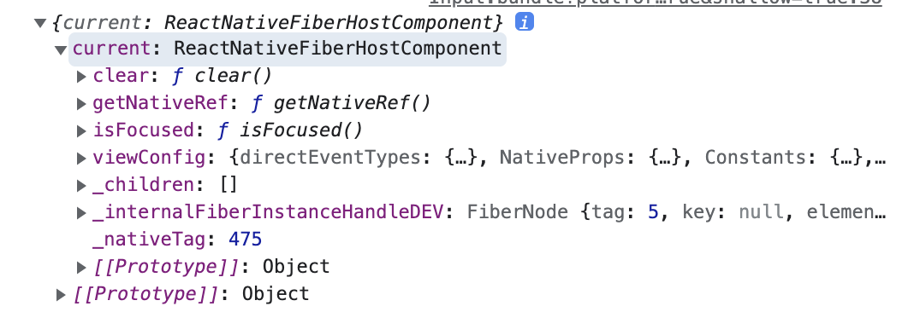

# 05-2 useRef 훅 이해하기

# ref란

- ref 는 reference의 앞 3글자를 딴 속성
- ref는 render 메서드에서 생성된 DOM 노드나 React 엘리먼트에 접근하는 방법을 제공
- 다시 말하자면, 일반적인 데이터 플로우에서 벗어나 직접적으로 컴포넌트의 인스턴스나 DOM을 수정해야 하는 경우 사용
- ref를 사용하면, 컴포넌트의 인스턴스를 얻어 컴포넌트의 메서드를 실행할 때도 쓸 수 있다.
- 예시 )
    - Input에 ref를 주고 console.log를 찍어보면..
        
        ```jsx
        const InputRef = useRef(); 
        console.log(InputRef);
        ...
        
        <TextInput ref={InputRef} />
        ```
        
    - ref로 컴포넌트의 인스턴스 객체를 얻어왔다. TextInput의  isFocused, clear 같은 메서드들이 있음을 볼 수 있다. 필요시 `ref.current.isFocused` 와 같이 메서드를 얻어와서 쓸 수 있다.
    
    
    

## 언제 Ref를 사용해야 할까?

- 바람직한 사용사례 ([https://ko.reactjs.org/docs/refs-and-the-dom.html](https://ko.reactjs.org/docs/refs-and-the-dom.html))
    - 포커스, 텍스트 선택영역, 혹은 미디어의 재생을 관리할 때.
    - 애니메이션을 직접적으로 실행시킬 때.
    - 서드 파티 DOM 라이브러리를 React와 같이 사용할 때.
- 선언적으로 해결될 수 있는 문제에서는 ref 사용을 지양하세요.
    - 예를 들어, Dialog 컴포넌트에서 open()과 close() 메서드를 두는 대신, isOpen이라는 prop을 넘겨주세요.

- (TS) ref 타입
    - ref 속성의 타입
        
        ```tsx
        interface RefAttributes<T> extends Attributes {
        	ref?: Ref<T>
        }
        ```
        
    - ref의 current속성
        
        ```jsx
        interface RefObject<T> {
        	readonly current: T | null;
        }
        ```
        

# Ref의 사용

## Ref 생성하기

1. class 컴포넌트: React.createRef
- `React.createRef()` 를 통해 생성되고, `ref` 어트리뷰트를 통해 React엘리먼트에 부착된다.  (참고만)

```jsx
class MyComponent extends React.Component {
  constructor(props) {
    super(props);
    this.myRef = React.createRef();
  }
  render() {
    return <div ref={this.myRef} />;
  }
}
```

1. 함수형 컴포넌트: **useRef 훅**

```jsx
function CustomTextInput(props) {
  const textInput = useRef(null);

  function handleClick() {
    textInput.current.focus();
  }

  return (
    <div>
      <input
        type="text"
        ref={textInput} />
      <input
        type="button"
        value="Focus the text input"
        onClick={handleClick}
      />
    </div>
  );
}
```

## 사용 시 주의할 점

- 함수 컴포넌트는 인스턴스가 없기 때문에 **함수 컴포넌트에 ref 어트리뷰트를 사용할 수 없습니다**.
    
    ```jsx
    // 이 코드는 동작하지 않는다.
    <MyFunctionComponent ref={Ref} />
    ```
    
- 함수 컴포넌트에 ref를 사용할 수 있도록 하려면, forwardRef를 사용하거나 클래스 컴포넌트로 변경할 수 있습니다.

## useRef 훅 더 알아보기

### (TS) useRef의 함수 타입

```jsx
function useRef<T>(initialValue: T | null): RefObject<T>;
```

- TS + useRef 훅 사용 예시
    
    ```jsx
    import React, {useRef} from 'rect'
    ..
    
    const flatListRef = useRef<FlatList | null>(null)
    ..
    
    <FlatList ref={flatList} />
    ```
    
- 위 예시에서 flatList의 scrollToEnd 메서드 사용하기
    
    ```tsx
    flatListRef.current?.scrollToEnd();
    ```
    
    - ? (옵션 체이닝 연산자)를 사용한 이유는, ref의 타입이 FlatList | null 이기에, 값이 null로 들어올 수 있기 때문

### useRef 활용 예시

- 책 예시1 (p 332) : FlatList 높이가 바뀌면(아이템이 추가되면) 스크롤을 끝까지 내리기
    - flatListRef.current?.scrollToEnd() 를
    - FlatList의 메서드인 onContentSizeChange에 전달하여 사이즈가 바뀔때마다 실행해줌
    
- 책 예시2 (p 336) : 버튼을 누르면 TextInput에 포커스 시키기
    - Button을 onPress하면
    - textInputRef.current?.focus() 를 실행해줌

- 책 예시3 (p 336~) : 갑자기 키보드 관련 API 설명하기
    - 화면에 올라오는 키보드를 강제로 내리기
        - RN에서 제공하는 Keyboard API를 이용
            
            ```tsx
            import {Keyboard} from 'react-native'
            ..
            
            const dismissKeyboard = () => {
            	Keyboard.dismiss()
            }
            ```
            
    - TextInput에 포커스했을 때 Input이 키보드 밑에 깔려있으면?
        - RN에서 제공하는 KeyboardAvoidingView 코어 컴포넌트를 이용
        - 키보드가 올라오면 스크롤하여  TextInput을 가리지 않도록 해줌
        
        ```tsx
        <KeyboardAvoidingView>
        	...
        	<TextInput ... />
        </KeyboardAvoidingView>
        ```
        
        - 안드로이드에서 버그가 있다.
            - react-native-keyboard-aware-scroll-view 라이브러리를 사용한다
    

이후는 위 예시들의 context + 예시 등 심화 구현 코드 (생략)